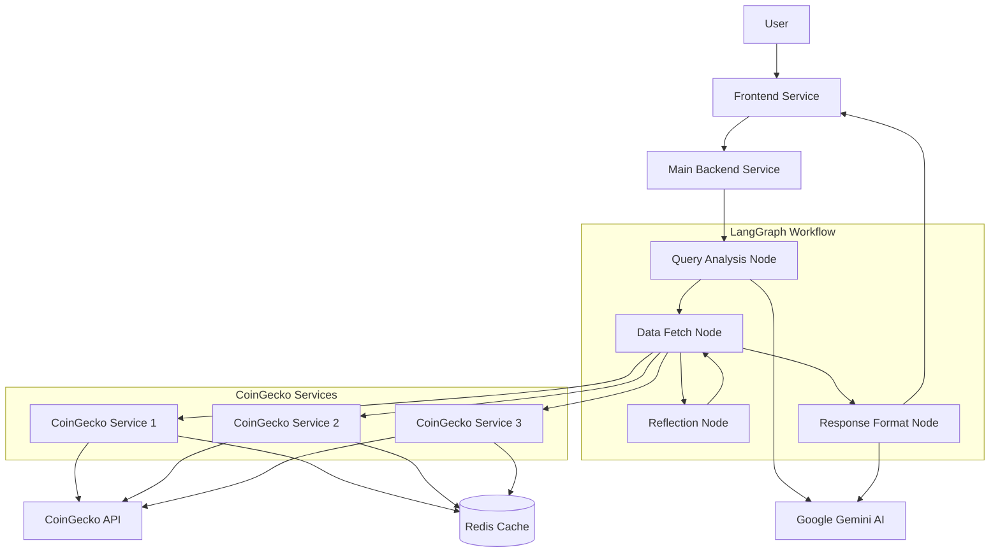
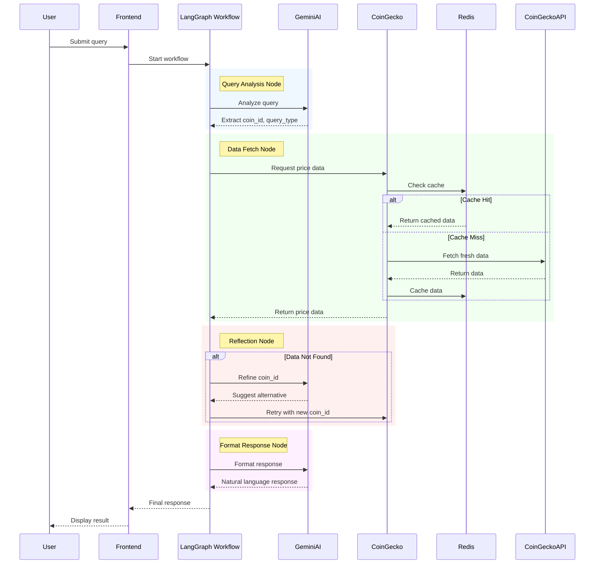
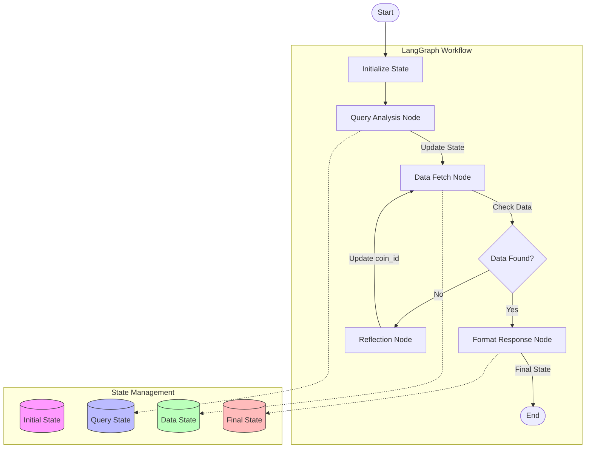
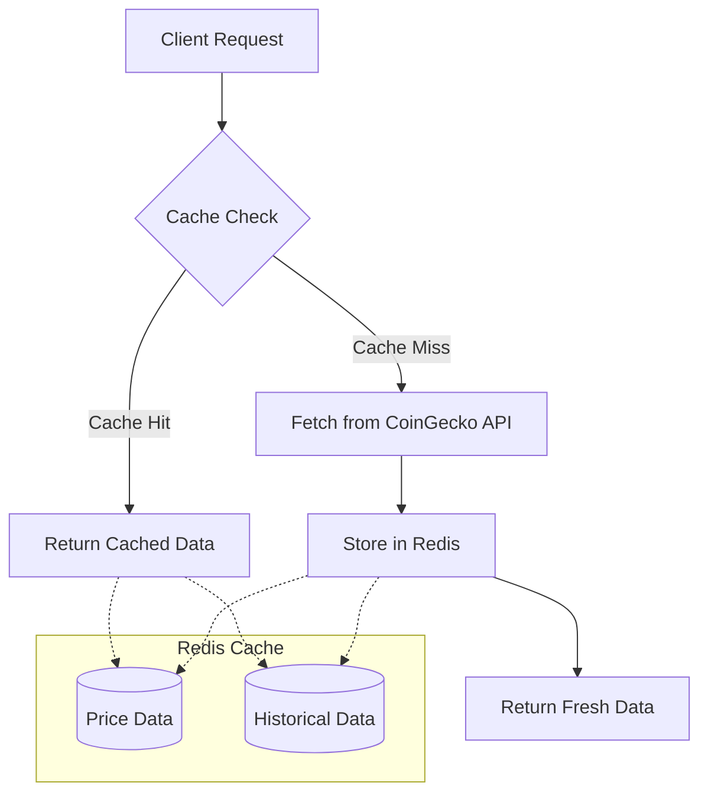

# Crypto Price AI Agent

# Main application description
An intelligent agent built with LangGraph and FastAPI that provides cryptocurrency price information using a microservices architecture. The system consists of multiple services that work together to process natural language queries and provide real-time cryptocurrency data.

## 🏗 Architecture Overview

The application is structured as a microservices-based system with the following components:

### System Architecture



### Query Processing Flow



### State Management Flow



### Caching Mechanism



### Core Services

1. **Main Backend Service** (`/app`)
   - Natural language query processing using Google's Gemini AI
   - LangGraph-based workflow management
   - Request routing and orchestration
   - Rate limiting and error handling

2. **CoinGecko Service** (`/services/coingecko`)
   - Dedicated cryptocurrency data microservice
   - Real-time price data retrieval
   - Historical price data analysis
   - Redis-based caching layer
   - Horizontal scaling support

3. **Frontend Service** (`/streamlit_app.py`)
   - Interactive Streamlit-based UI
   - Real-time data visualization
   - Dynamic price charts
   - System status monitoring

4. **Redis Service**
   - Distributed caching system
   - Performance optimization
   - Service state management

## 📁 Project Structure

```
.
├── app/                        # Main Backend Service
│   ├── core/                  # Core Configuration
│   │   ├── config.py         # Application configuration
│   │   └── logging.py        # Logging setup
│   ├── graph/                # LangGraph Workflow
│   │   ├── nodes.py         # Workflow nodes
│   │   ├── state.py         # State management
│   │   └── workflow.py      # Graph configuration
│   ├── prompts/             # AI Prompts
│   │   └── templates.py     # Prompt templates
│   └── services/            # Service Clients
│       └── coingecko.py     # CoinGecko client will call to microserive of coingecko
│
├── services/                  # Microservices
│   └── coingecko/           # CoinGecko Service
│       ├── main.py          # Service implementation
│       ├── Dockerfile       # Service container
│       └── requirements.txt # Service dependencies
│
├── docker/                    # Docker Configuration
│   ├── backend.Dockerfile   # Backend service
│   └── frontend.Dockerfile  # Frontend service
│
├── main.py                    # Main service entry
├── streamlit_app.py          # Frontend application
├── docker-compose.yml        # Service orchestration
└── requirements.txt          # Main dependencies
```

## ✨ Features

### Natural Language Processing
- Advanced query understanding using Google's Gemini AI
- Automatic cryptocurrency name resolution
- Context-aware response generation
- Query refinement for failed requests

### Cryptocurrency Data
- Real-time price information
- Historical price analysis
- Market capitalization data
- 24-hour price changes
- Interactive price charts

### System Features
- Microservices architecture
- Horizontal scaling capability
- Redis caching layer
- Rate limiting protection
- CORS support
- Comprehensive error handling
- Detailed logging system

### Frontend Interface
- Modern, responsive design
- Real-time data updates
- Interactive charts
- Query suggestions
- Error feedback
- System status monitoring

## 🚀 Getting Started

### Prerequisites
- Python 3.9+
- Docker and Docker Compose
- Redis (optional for local development)
- Google Gemini API key

### Environment Setup

1. Clone the repository:
```bash
git clone <repository-url>
cd crypto-price-ai-agent
```

2. Create and configure environment variables:
```bash
cp .env.example .env
# Edit .env with your configuration
```

Required environment variables:
- `GEMINI_API_KEY`: Your Google Gemini API key
- `REDIS_URL`: Redis connection URL (default: redis://localhost:6379)
- `PORT`: Port for the CoinGecko service (default: 8001)

### Docker Deployment

1. Build and start all services:
```bash
docker-compose up --build
```

Services will be available at:
- Frontend: http://localhost:8501
- Main Backend: http://localhost:8000
- CoinGecko Service: http://localhost:8001

### Service Management

Scale the CoinGecko service:
```bash
docker-compose up -d --scale coingecko=3
```

View service logs:
```bash
docker-compose logs -f [service_name]
```

## 📝 API Documentation

### Main Backend Endpoints

#### Query Endpoint
```bash
POST /query
Content-Type: application/json
{
    "query": "What is the current price of Bitcoin?"
}
```