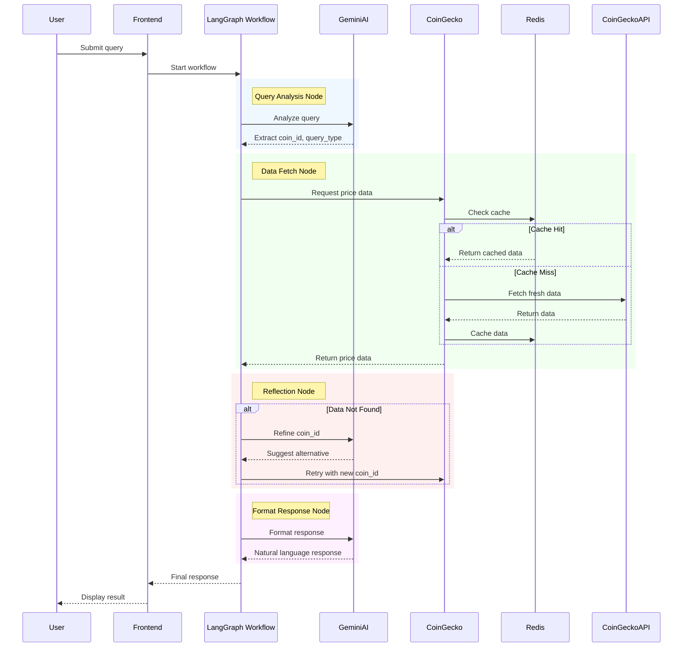
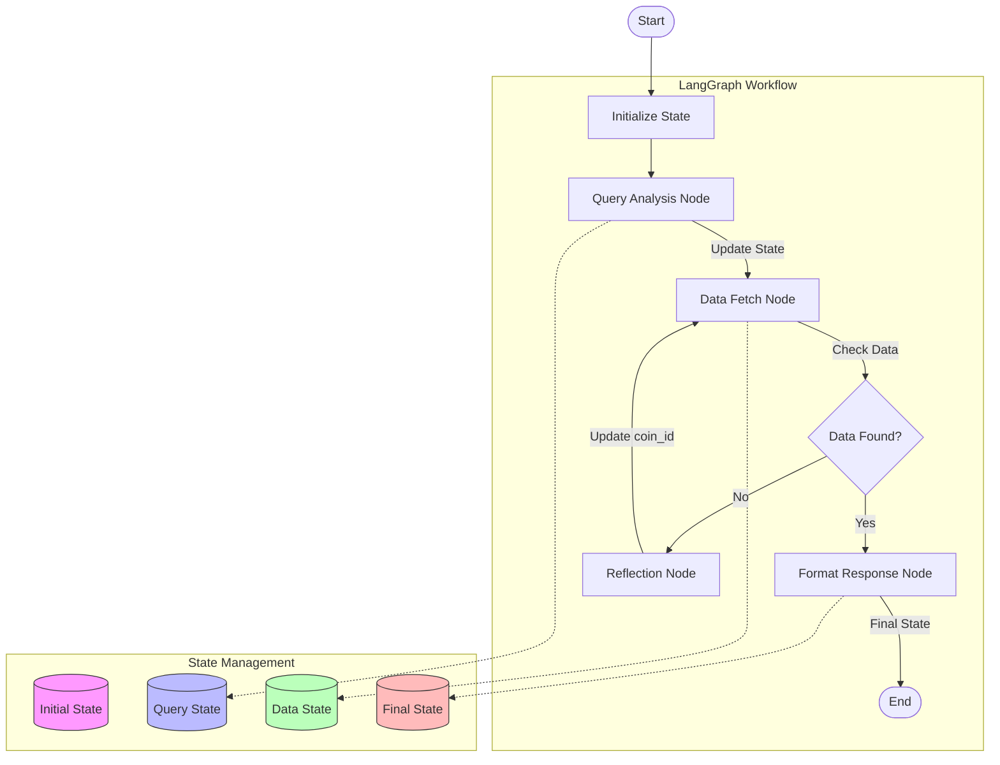
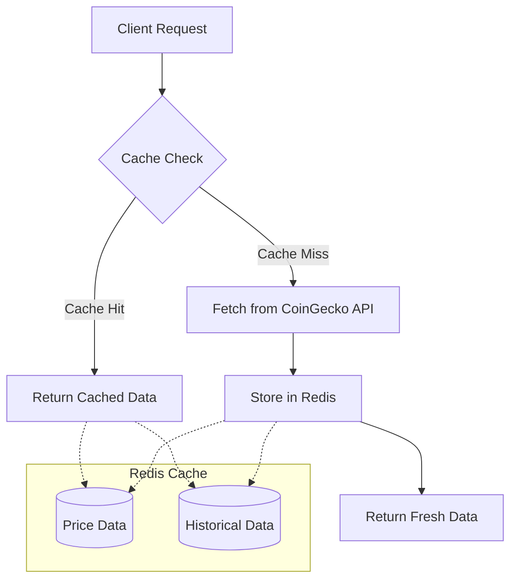

# Technical Documentation

This document provides detailed technical information about the internal workings of the Crypto Price AI Agent.

## Query Processing Flow

## State Management Flow

## Caching Mechanism

## Technical Details

### LangGraph Workflow
The application uses LangGraph to orchestrate the natural language processing workflow:
1. **Query Analysis**: Extracts cryptocurrency information and query type
2. **Data Fetching**: Retrieves price data with caching
3. **Reflection**: Handles failed queries with alternative suggestions
4. **Response Formatting**: Generates natural language responses

### State Management
The workflow maintains state throughout the process:
- Initial State: Raw user query
- Query State: Analyzed query with extracted parameters
- Data State: Retrieved cryptocurrency data
- Final State: Formatted response

### Caching Strategy
Redis is used for caching with the following features:
- Separate cache keys for price and historical data
- 60-second TTL for all cached data
- Automatic cache invalidation
- Cache hit/miss logging 